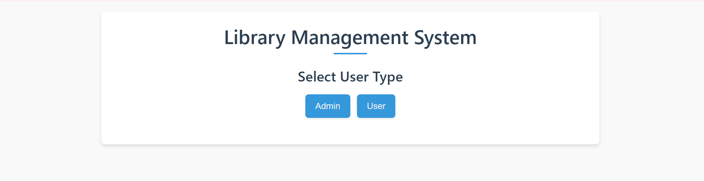

# Library Management System

## Project Overview
A web-based library management system that streamlines book inventory, user management, and borrowing operations. The application offers different interfaces for administrators and regular users to efficiently manage library resources.

## Features

### Admin Features
- Secure login with password protection
- Add new books to the library inventory
- View complete book catalog with availability status
- Track book returns and pending checkouts
- Calculate fines for overdue books

### User Features
- Search for books by title, author, or ISBN
- Return borrowed books
- Check book availability

## Technologies Used
- Frontend: HTML, CSS, JavaScript
- Backend: Node.js, Express.js
- Database: MySQL 8.0
- Additional tools: RESTful API architecture

## Installation

```bash
# Clone the repository
git clone https://github.com/yourusername/library-management-system.git

# Navigate to project directory
cd library-management-system

# Install dependencies
npm install

# Set up the database
# Run schema.sql in MySQL client

# Start the application
npm start
```

## Usage
Access the application at `http://localhost:3000`

Admin credentials:
- Username: admin
- Password: admin123

## Screenshots



## Future Enhancements
- User registration and authentication system
- Email notifications for due dates
- Book reservation system
- Reporting and analytics dashboard

## License
[Your chosen license]
